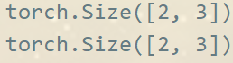

**张量**的英文是Tensor，它是PyTorch里面基础的运算单位，与Numpy的`ndarray`相同都表示的是一个多维的矩阵。 与ndarray的最大区别就是，PyTorch的Tensor可以在 GPU 上运行，而 numpy 的 `ndarray` 只能在CPU 上运行，在GPU上运行大大加快了运算速度。

# 创建张量
下面的代码可以创建一个简单的张量
```python
import torch
import numpy as np
x = torch.rand(2, 3)
```
# 查看大小
要**查看张量的大小**,可以使用`shape`属性或者`size()`方法.
```python
print(x.shape)
print(x.size())
```
二者的输出是一样的



# 生成多维张量

```python
y=torch.rand(2,3,4,5)
print(y.size())
print(y)
```

得到的输出是
```
torch.Size([2, 3, 4, 5])
tensor([[[[2.6002e-01, 3.3447e-01, 1.0443e-01, 4.3503e-01, 6.7630e-01],
          [8.6587e-01, 9.8064e-01, 2.6400e-01, 1.1179e-01, 3.4802e-01],
          [2.5601e-01, 9.6177e-01, 3.5883e-01, 2.0013e-01, 6.8165e-01],
          [6.2684e-01, 3.0240e-03, 3.7631e-01, 3.4672e-01, 2.7540e-02]],

         [[9.9220e-01, 2.7887e-03, 5.9371e-01, 6.9895e-01, 1.2004e-01],
          [7.3295e-02, 7.1826e-01, 8.4186e-01, 6.3437e-01, 5.9095e-01],
          [1.6393e-01, 9.9219e-01, 2.4317e-03, 1.0621e-01, 4.4525e-01],
          [1.5682e-01, 6.9267e-01, 3.8897e-01, 1.6646e-01, 7.5840e-01]],

         [[3.1855e-01, 7.0359e-01, 3.4772e-01, 7.6073e-01, 5.8970e-01],
          [4.6748e-01, 7.3435e-01, 5.7699e-01, 8.8527e-01, 9.8030e-01],
          [5.1938e-01, 9.0266e-01, 2.3618e-03, 8.9499e-01, 8.8838e-01],
          [7.5922e-01, 9.4626e-01, 5.2163e-01, 9.3226e-01, 6.0843e-01]]],


        [[[4.7325e-01, 4.9591e-05, 1.8680e-01, 2.3310e-01, 6.1507e-01],
          [3.6418e-01, 6.9074e-01, 9.0198e-02, 3.6990e-01, 5.6086e-01],
          [9.6608e-02, 2.6279e-02, 3.6371e-01, 2.2809e-01, 1.7488e-01],
          [5.1658e-01, 1.3236e-01, 9.6432e-01, 5.7729e-01, 4.2390e-01]],

         [[4.0292e-01, 3.9575e-01, 6.1827e-02, 5.8126e-01, 2.7342e-01],
          [8.0864e-01, 6.1763e-01, 8.0366e-01, 2.7889e-01, 4.1793e-01],
          [2.7236e-01, 9.7171e-03, 4.1310e-01, 4.0523e-01, 8.4379e-02],
          [7.2023e-02, 5.7967e-01, 5.3721e-01, 3.8429e-01, 3.8001e-01]],

         [[3.5850e-01, 1.9662e-01, 6.9487e-01, 8.9257e-01, 2.2955e-01],
          [4.0636e-01, 4.4941e-01, 3.4342e-02, 7.1537e-02, 5.6414e-01],
          [1.9788e-01, 5.9342e-01, 7.4673e-01, 3.2405e-01, 2.1851e-01],
          [1.2565e-02, 9.0173e-01, 8.0705e-01, 4.2722e-01, 1.3103e-01]]]])
```

在同构的意义下，

第零阶张量$(r=0)$为标量 (Scalar), 

第一阶张量$(r=1)$为向量 (Vector), 

第二阶张量$(r=2)$则成为矩阵 (Matrix), 

第三阶以上的统称为多维张量。

# 标量

```python
# 我们直接使用现有数字生成
scalar = torch.tensor(3.1433223)
print(scalar)
# 打印标量的大小
print(scalar.shape)
```

得到的输出是
```
tensor(3.1433)
torch.Size([])
```

对于标量，我们可以直接使用 `.item()` 从中取出其对应的python对象的数值

```python
print(scalar.item())
```

得到的结果
```
3.143322229385376
```

特别的：如果张量中**只有一个元素**的tensor也可以调用`tensor.item()`方法

```python
tensor = torch.tensor([3.1433223])
print(tensor)
print(tensor.size())
print(tensor.item())
```

输出
```
tensor([3.1433])
torch.Size([1])
3.143322229385376
```

# 基本类型

Tensor的基本数据类型有五种：

1. 32位浮点型：`torch.FloatTensor`。 (**默认**)
2. 64位整型：`torch.LongTensor`。
3. 32位整型：`torch.IntTensor`。
4. 16位整型：`torch.ShortTensor`。
5. 64位浮点型：`torch.DoubleTensor`。

除以上数字类型外，还有 `byte`和`char`型

```
long = tensor.long()
half = tensor.half()
int_t = tensor.int()
flo = tensor.float()
short = tensor.short()
ch = tensor.char()
bt = tensor.byte()
print(long)
print(half)
print(int_t)
print(flo)
print(short)
print(ch)
print(bt)
```

输出
```
tensor([3])
tensor([3.1426], dtype=torch.float16)
tensor([3], dtype=torch.int32)
tensor([3.1433])
tensor([3], dtype=torch.int16)
tensor([3], dtype=torch.int8)
tensor([3], dtype=torch.uint8)
```

# Numpy转换

使用`numpy()`方法将Tensor转为ndarray
```python
a = torch.randn((3, 2))
# tensor转化为numpy
numpy_a = a.numpy()
print(numpy_a)
```

输出
```
[[ 1.1509079  -1.4211928 ]
 [-0.14997266 -2.0371623 ]
 [-0.92544305  1.0272205 ]]
 ```

 使用`from_numpy()`方法将ndarray转为Tensor
 ```python
 torch_a = torch.from_numpy(numpy_a)
print(torch_a)
```
输出
```
tensor([[ 0.1572,  1.0856],
        [-0.0816,  0.5190],
        [-0.5995, -1.2664]])
```

Tensor和numpy对象共享内存，所以他们之间的转换很快，而且几乎不会消耗什么资源。但这也意味着，如果其中一个变了，另外一个也会随之改变。

# 设备间转换
一般情况下可以使用`.cuda()`方法将tensor移动到gpu，这步操作需要cuda设备支持.使用`.cpu()`方法则能将tensor移动到cpu
```python
cpu_a = torch.rand(4, 3)
print(cpu_a.type())
gpu_a = cpu_a.cuda()
print(gpu_a.type())
cpu_b = gpu_a.cpu()
print(cpu_b.type())
```
输出
```
torch.FloatTensor
torch.cuda.FloatTensor
torch.FloatTensor
```

如果我们有多GPU的情况，可以使用`to()`方法来确定使用那个设备，这里只做个简单的实例：
```python
# 使用torch.cuda.is_available()来确定是否有cuda设备
device = torch.device("cuda" if torch.cuda.is_available() else "cpu")
print(device)
# 将tensor传送到设备
gpu_b = cpu_b.to(device)
print(gpu_b.type())
```
输出
```
cuda
torch.cuda.FloatTensor
```

# 初始化
Pytorch中有许多默认的初始化方法可以使用
```python
# 使用[0,1]均匀分布随机初始化二维数组
rnd = torch.rand(5, 3)
# 初始化，使用1填充
one = torch.ones(2, 2)
# 初始化，使用0填充
zero = torch.zeros(2, 2)
# 初始化一个单位矩阵，即对角线为1 其他为0
eye = torch.eye(2, 2)

print(rnd, '\n', one, '\n', zero, '\n', eye)
```
输出
```
tensor([[0.9395, 0.4871, 0.6116],
        [0.4500, 0.3893, 0.8733],
        [0.1386, 0.5436, 0.7679],
        [0.5461, 0.3084, 0.5925],
        [0.2473, 0.8434, 0.9237]]) 
 tensor([[1., 1.],
        [1., 1.]]) 
 tensor([[0., 0.],
        [0., 0.]]) 
 tensor([[1., 0.],
        [0., 1.]])
```

# 常用方法
```python
x = torch.randn(3, 3)
print(x)

# 沿着行取最大值
max_value, max_idx = torch.max(x, dim=1)
print(max_value, max_idx)

# 每行 x 求和
sum_x = torch.sum(x, dim=1)
print(sum_x)


y=torch.randn(3, 3)
z = x + y
print(z)

# add 完成后x的值改变了
x.add_(y)
print(x)
```
输出
```
tensor([[-1.4854, -0.2209, -1.2968],
        [-0.0864,  2.2062, -0.5099],
        [ 0.9258,  0.6745, -0.6204]])
tensor([-0.2209,  2.2062,  0.9258]) tensor([1, 1, 0])
tensor([-3.0031,  1.6099,  0.9799])
tensor([[-1.5674,  3.2332, -3.2982],
        [-0.3310,  4.1485,  1.2803],
        [ 0.9905,  0.9147, -0.7264]])
tensor([[-1.5674,  3.2332, -3.2982],
        [-0.3310,  4.1485,  1.2803],
        [ 0.9905,  0.9147, -0.7264]])
```

带"_"的方法会改变调用的值